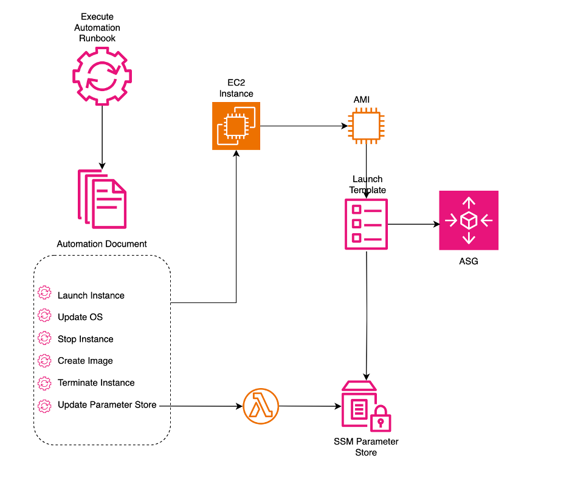
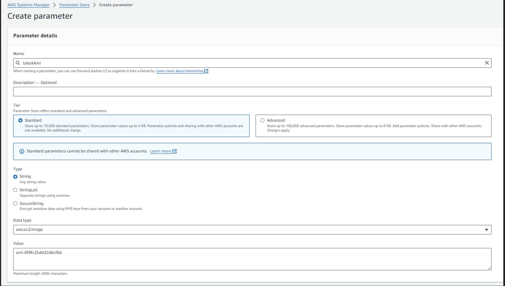
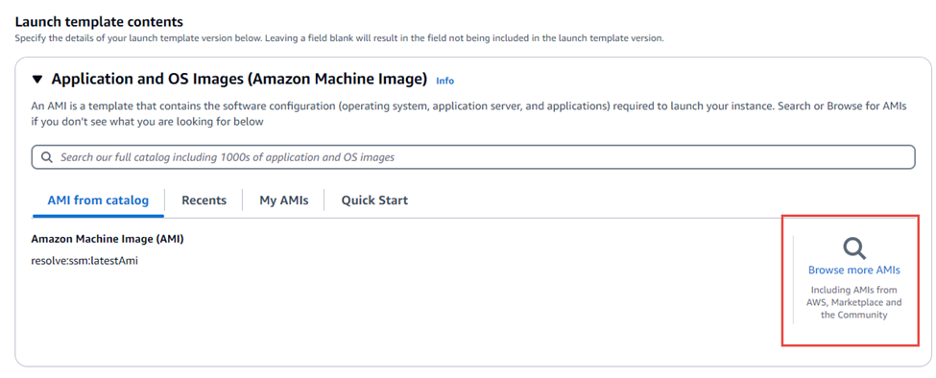
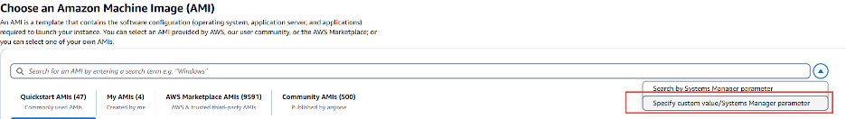
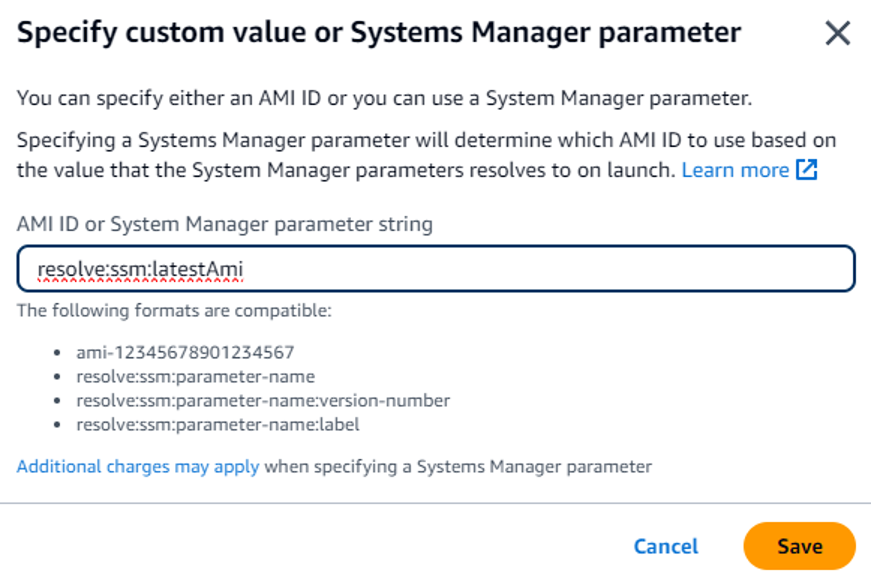
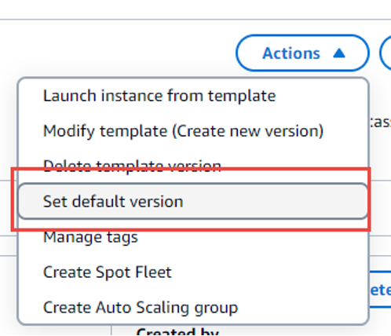

**Update AMIs for Auto Scaling group by using SSM Automation, AWS Lambda,and SSM Parameter Store**
--------------------------------------------------------------------------------------------------

Keeping [AmazonMachine Image](https://docs.aws.amazon.com/AWSEC2/latest/UserGuide/AMIs.html) (AMI) up-to-date with the latest patches and updatesis a critical task for organizations using AWS [Auto Scaling group](https://docs.aws.amazon.com/autoscaling/ec2/userguide/auto-scaling-groups.html) . However, manuallypatching AMIs and updating Auto Scaling groups can be time-consuming anderror-prone. This blog post presents a solution to automate the process ofupdating AMIs for Auto Scaling groups using AWS services like [AWS Systems Manager](https://aws.amazon.com/systems-manager/),[AWSLambda](https://docs.aws.amazon.com/lambda/latest/dg/welcome.html), and [AWSSystems Manager Parameter Store](https://docs.aws.amazon.com/systems-manager/latest/userguide/systems-manager-parameter-store.html).

The key challenge is ensuringthat Auto Scaling groups always launch new instances from the latest, patchedAMI. This solution leverages Systems Manager Automation to patch the current"golden" AMI, create a new AMI from the patched instance, and updatethe AMI ID stored in Parameter Store. Auto Scaling groups can then referencethis updated AMI ID parameter to launch new instances from the latest patchedAMI.

By combining Automationrunbooks, Lambda functions, and Parameter Store, you can establish an automatedpipeline to keep your AMIs consistently up-to-date with minimal manual effort.This solution provides a scalable and repeatable approach to maintaining asecure and compliant AWS infrastructure

### **Solution Overview:**

The architecture of the solution can be broken down into sixsteps. Which are outlined in Figure 1.

1.    Launch an instance from Source AMI mentionedin SSM Parameter Store

2.    Executes SSM Run Command that applies thevendor updates to the instance

3.    Stops the instance

4.    Creates a new AMI

5.    Terminates the original instance

6.    Update the parameter store using Lambda

_Figure 1 – Architecture Diagram for updating AMI ID using SSM and lambda_

### **Prerequisites:**

*   You need to have an [AWS account](https://aws.amazon.com/free/?gclid=CjwKCAjwko21BhAPEiwAwfaQCMJb0CRuEuLKqMMdrXkR_YSdGoLCHh5wT1BwwmU--LrmLP122KxEsRoC6QcQAvD_BwE&trk=7541ebd3-552d-4f98-9357-b542436aa66c&sc_channel=ps&ef_id=CjwKCAjwko21BhAPEiwAwfaQCMJb0CRuEuLKqMMdrXkR_YSdGoLCHh5wT1BwwmU--LrmLP122KxEsRoC6QcQAvD_BwE:G:s&s_kwcid=AL!4422!3!651751058790!e!!g!!aws%20account%20creation%20free!19852662149!145019243897&all-free-tier.sort-by=item.additionalFields.SortRank&all-free-tier.sort-order=asc&awsf.Free%20Tier%20Types=*all&awsf.Free%20Tier%20Categories=*all).
    

*   You should have an existing Auto Scaling group that you want to update with new AMIs.
    

*   At minimum, AWS Systems Manager SSM Agent must be installed on the managed nodes you want to connect to via SSM.
    

*    IAM roles for Automation, a capability of AWS Systems Manager. Systems Manager requires an instance profile role and a service role ARN to process automations. The IAM roles need the following permissions: The Automation service role needs: ec2:RunInstances, ec2:CreateImage, ec2:TerminateInstances, lambda:InvokeFunction. The EC2 instance profile role needs: ssm:DescribeInstanceInformation, ssm:GetDeployablePatchSnapshotForInstance, ssm:UpdateInstanceInformation
    

*   (Optional) SSM VPC endpoints for managing private EC2 instances without internet access
    

**Note:**

The IAM roles forautomation will be deployed by the Cloudformation template.

### **Solution** **setup steps**

#### **Task 1: DeployCloudformation template.**

*   Download the UpdateMyLatestASGAmi.yml CloudFormation template from the GitHub repository (provide the GitHub link here).
    

*   Sign in to the AWS Management Console and open the CloudFormation service
    

*   Click "Create stack" and then choose "With new resources (standard)".
    

*   Under "Prerequisite - Prepare template", select "Template is ready".
    

*   Under "Specify template", select "Upload a template file".
    

*   Click "Choose file" and select the UpdateMyLatestASGAmi.yml file you downloaded from GitHub.
    

*   Click "Next".
    

*   On the "Specify stack details" page, provide a Stack name (e.g., UpdateMyLatestASGAmi).
    

*   Click "Next".
    

*   On the "Configure stack options" page, leave the defaults and click "Next".
    

*   On the "Review" page, scroll down, check the box to acknowledge that CloudFormation might create IAM resources, and click "Create stack".
    

Waitfor the CloudFormation stack to reach the "CREATE\_COMPLETE" status,which may take a few minutes.

### **IMPORTANT:**

In the us-east-1region, the CloudFormation template employs ami-0f9fc25dd2506cf6d. The AMI IDin the CloudFormation template will need to be updated to reflect an AmazonLinux 2023 image in the region you deploy the solution to. If you would like toobtain the AMI ID for a region, please follow [this](https://docs.aws.amazon.com/AWSEC2/latest/UserGuide/finding-an-ami.html) instruction.

#### **Task 2: Create a Parameterin SSM Parameter Store for the AMI ID**

Create a stringparameter in Parameter Store that uses the following information:

·       Name: latestAmi

·       Value: An AMI ID. For example:ami-0f9fc25dd2506cf6d

·       Data Type: aws:ec2:image

An example isdisplayed below, in Figure 2.

_Figure 2: Create aparameter in SSM parameter store_

Task3: **Create an AWS Lambda function**

1.    Signin to the AWS Management Console and open the AWS Lambda console at [https://console.aws.amazon.com/lambda/](https://console.aws.amazon.com/lambda/).

2.    Choose **Createfunction**.

3.    Onthe **Create function** page, choose **Author from scratch**.

4.    For **Functionname**, enter **Automation-UpdateSsmParam**.

5.    For **Runtime**,choose **Python3.12**.[\[TT3\]](#_msocom_3) 

6.    For **Architecture**,select the type of computer processor for Lambda to use to run thefunction, **x86\_64** or **arm64**,

7.    Inthe **Permissions** section, expand **Change defaultexecution role**.

8.    Choose **Usean existing role**, and then choose the service role for Lambda that was createdin the CloudFormation template.

9.    Choose **Createfunction**.

10.  In the **Code source** area,on the **lambda\_function** tab, delete the pre-populated code inthe field, and then paste the following code sample.

from \_\_future\_\_ importprint\_function

importjson

importboto3

print('Loadingfunction')

#Updatesan SSM parameter

#ExpectsparameterName, parameterValue

deflambda\_handler(event, context):

    print("Received event: " +json.dumps(event, indent=2))

    # get SSM client

    client = boto3.client('ssm')

    #confirm parameter exists before updating it

    response = client.describe\_parameters(

       Filters=\[

          {

           'Key': 'Name',

           'Values': \[ event\['parameterName'\] \]

          },

        \]

    )

    if not response\['Parameters'\]:

        print('No such parameter')

        return 'SSM parameter not found.'

    #if parameter has a Description field,update it PLUS the Value

    if 'Description' inresponse\['Parameters'\]\[0\]:

        description =response\['Parameters'\]\[0\]\['Description'\]

        response = client.put\_parameter(

          Name=event\['parameterName'\],

          Value=event\['parameterValue'\],

          Description=description,

          Type='String',

          Overwrite=True

        )

    #otherwise just update Value

    else:

        response = client.put\_parameter(

          Name=event\['parameterName'\],

          Value=event\['parameterValue'\],

          Type='String',

          Overwrite=True

        )

    responseString = 'Updated parameter %s withvalue %s.' % (event\['parameterName'\], event\['parameterValue'\])

    return responseString

11.  Choose **File, Save**.

12.  To test the Lambda function,from the **Test** menu, choose **Configure test event**.

13.  For **Event name**,enter a name for the test event, such as **MyTestEvent**.

14.  Replace the existing text withthe following JSON. Replace _AMI ID_ with your own informationto set your latestAmi parameter value.

{

   "parameterName":"latestAmi",

   "parameterValue":"_AMIID_"

}

15.  Choose **Save**.

16.  Choose **Test** to test the function. Onthe **Execution result** tab, the status should be reportedas **Succeeded**, along with other details about the update.

#### **Task4: Update the Launch Template for the ASG to point to SSM parameter store**

Toupdate a launch template that specifies a parameter for the AMI, use one of thefollowing methods:

1.    Open the Amazon EC2 console at [https://console.aws.amazon.com/ec2/](https://console.aws.amazon.com/ec2/).

2.    In the navigationpane, choose Launch Templates, and then choose the Launch Template ID that wasdeployed by the CloudFormation template and select **Actions > Modifytemplate**.

3.    Under Applicationand OS Images (Amazon Machine Image), choose **Browse more AMIs**.

              _Figure 3– Browse more AMIs_

4.    Choose the arrow button to the right of thesearch bar, and then choose **Specify custom value/Systems Manager parameter.**

_Figure 4 – chooseSpecify custom value/Systems Manager parameter_**.**

5.    In the Specify custom value or Systems Managerparameter, enter **“resolve:ssm:latestAmi”**

_Figure 5 –_ _Specify custom value or Systems Manager parameter_

6.    Save the changes and select **“Create templateversion”.**

7.    Ensure you have the new version is the **“defaultversion”.**

_Figure 6 –_ _Set the template to Default Version_

#### **Task5: Create an Automation** **Runbook**

Usethe following procedure to create and run a runbook that patches the AMI youspecified for the latestAmi parameter. After the automation completes, thevalue of latestAmi is updated with the ID of the newly-patched AMI. Thisapproach ensures that new images are automatically made available to differentcomputing environments that use Auto Scaling groups.

**Tocreate and run the runbook**

1.    Navigate to the AWS Systems Manager console byvisiting [https://console.aws.amazon.com/systems-manager/](https://console.aws.amazon.com/systems-manager/).

2.    In the left-hand navigation pane, select"Documents".

3.    Click on "Create document" and thenchoose "Automation" from the options presented.

4.    In the visual editor that appears, locate thedefault name in the top left corner. Click on it and change it to "UpdateMyLatestAmi".

5.    Look for a toggle switch that allows you toswitch between "Design" and "Code" views. Switch it to"Code" view.

6.    In the code editor that appears, you can nowinput the following code

\---

description: Systems Manager Automation Demo - Patch AMI andUpdate ASG

schemaVersion: '0.3'

assumeRole: '{{ AutomationAssumeRole }}'

parameters:

  AutomationAssumeRole:

    type: String

    description: '(Required)The ARN of the role that allows Automation to perform the actions on yourbehalf. If no role is specified, Systems Manager Automation uses your IAMpermissions to execute this document.'

    default: ''

  SourceAMI:

    type: String

    description: The ID ofthe AMI you want to patch.

    default: '{{ssm:latestAmi }}'

  SubnetId:

    type: String

    description: The ID ofthe subnet where the instance from the SourceAMI parameter is launched.

  SecurityGroupIds:

    type: StringList

    description: The IDs ofthe security groups to associate with the instance that's launched from theSourceAMI parameter.

  NewAMI:

    type: String

    description: The name ofof newly patched AMI.

    default:'patchedAMI-{{global:DATE\_TIME}}'

  InstanceProfile:

    type: String

    description: The name ofthe IAM instance profile you want the source instance to use.

  SnapshotId:

    type: String

    description: (Optional)The snapshot ID to use to retrieve a patch baseline snapshot.

    default: ''

  RebootOption:

    type: String

    description: '(Optional)Reboot behavior after a patch Install operation. If you choose NoReboot andpatches are installed, the instance is marked as non-compliant until asubsequent reboot and scan.'

    allowedValues:

      - NoReboot

      - RebootIfNeeded

    default: RebootIfNeeded

  Operation:

    type: String

    description: (Optional)The update or configuration to perform on the instance. The system checks ifpatches specified in the patch baseline are installed on the instance. Theinstall operation installs patches missing from the baseline.

    allowedValues:

      - Install

      - Scan

    default: Install

mainSteps:

  - name: startInstances

    action:'aws:runInstances'

    timeoutSeconds: 1200

    maxAttempts: 1

    onFailure: Abort

    inputs:

      ImageId: '{{ SourceAMI}}'

      InstanceType: m5.large

      MinInstanceCount: 1

      MaxInstanceCount: 1

     IamInstanceProfileName: '{{ InstanceProfile }}'

      SubnetId: '{{ SubnetId}}'

      SecurityGroupIds: '{{SecurityGroupIds }}'

  - name:verifyInstanceManaged

    action:'aws:waitForAwsResourceProperty'

    timeoutSeconds: 600

    inputs:

      Service: ssm

      Api:DescribeInstanceInformation

     InstanceInformationFilterList:

        - key: InstanceIds

          valueSet:

            - '{{startInstances.InstanceIds }}'

      PropertySelector:'$.InstanceInformationList\[0\].PingStatus'

      DesiredValues:

        - Online

    onFailure:'step:terminateInstance'

  - name: installPatches

    action: 'aws:runCommand'

    timeoutSeconds: 7200

    onFailure: Abort

    inputs:

      DocumentName:AWS-RunPatchBaseline

      Parameters:

        SnapshotId:'{{SnapshotId}}'

        RebootOption:'{{RebootOption}}'

        Operation:'{{Operation}}'

      InstanceIds:

        - '{{startInstances.InstanceIds }}'

  - name: stopInstance

    action:'aws:changeInstanceState'

    maxAttempts: 1

    onFailure: Continue

    inputs:

      InstanceIds:

        - '{{startInstances.InstanceIds }}'

      DesiredState: stopped

  - name: createImage

    action:'aws:createImage'

    maxAttempts: 1

    onFailure: Continue

    inputs:

      InstanceId: '{{startInstances.InstanceIds }}'

      ImageName: '{{ NewAMI}}'

      NoReboot: false

      ImageDescription:Patched AMI created by Automation

  - name: terminateInstance

    action:'aws:changeInstanceState'

    maxAttempts: 1

    onFailure: Continue

    inputs:

      InstanceIds:

        - '{{startInstances.InstanceIds }}'

      DesiredState:terminated

  - name: updateSsmParam

    action:aws:invokeLambdaFunction

    timeoutSeconds: 1200

    maxAttempts: 1

    onFailure: Abort

    inputs:

        FunctionName:Automation-UpdateSsmParam

        Payload:'{"parameterName":"latestAmi","parameterValue":"{{createImage.ImageId}}"}'

outputs:

\- createImage.ImageId

1.    Choose **Create automation**.

2.    In the navigation pane, choose **Automation**,and then choose **Execute automation**.

3.    In the **Choose document** page, choose the **Ownedby me** tab.

4.    Search for the **UpdateMyLatestAmi**runbook, and select the button in the **UpdateMyLatestAmi** card.

5.    Choose **Next**.

6.    Choose **Simple execution.**

7.    Specify values for the input parameters.

8.    Choose **Execute**.

9.    After the automation completes, choose **ParameterStore** in the navigation pane and confirm that the new value for latestAmimatches the value returned by the automation. You can also verify the new AMIID matches the Automation output in the **AMIs** section of the Amazon EC2console.

### **Note:**

Whenyou specify aws:ec2:image as the data type for a parameter, Systems Managerdoesn't create the parameter immediately. It instead performs an asynchronousvalidation operation to ensure that the parameter value meets the formattingrequirements for an AMI ID, and that the specified AMI is available in your AWSaccount.

Aparameter version number might be generated before the validation operation iscomplete. The operation might not be complete even if a parameter versionnumber is generated.

Optional:Setting up Notifications Based on Parameter Store Events

You can set up notificationsto be alerted when a Parameter Store parameter is updated, deleted, or created.This can be useful for monitoring changes to the latestAmi parameter andreceiving notifications when it is updated with a new AMI ID.

To set up notifications, youcan configure AWS CloudWatch Events to capture Parameter Store events and sendnotifications to an Amazon SNS topic. Here's a high-level overview of theprocess:

2.  Create an Amazon SNS topic that will receive the notifications.
    

4.  In the CloudWatch console, create a new event rule to capture Parameter Store events for the specific parameter(s) you want to monitor (e.g., latestAmi).
    

6.  Add the Amazon SNS topic you created as a target for the event rule.
    

8.  Configure subscribers (e.g., email addresses) to the SNS topic to receive notifications.
    

You can follow the detailedinstructions in the AWS Systems Manager User Guide: [MonitoringAWS Systems Manager Parameter Store Events](https://docs.aws.amazon.com/systems-manager/latest/userguide/sysman-paramstore-cwe.html).

By setting up this event ruleand SNS topic, you will receive notifications whenever the specified ParameterStore parameter(s) are updated, created, or deleted.

### **Summary**

This blog demonstrates how toautomatically keep AMIs up-to-date for Auto Scaling groups by leveraging AWSSystems Manager Automation, Lambda, and Parameter Store. Instead of manuallypatching AMIs, you can set up an automated workflow to patch the current goldenAMI, create a new patched AMI version, and update the AMI parameter referencedby your Auto Scaling groups. This approach ensures your infrastructure uses thelatest, fully patched AMIs without any manual efforts.

While this use case focused on patching AMIs, the automation capabilities of AWS Systems Manager can beextended to consistently maintain other aspects of your AWS environment. Tryout this solution yourself and experience how Automation runbooks can streamlineyour operations.